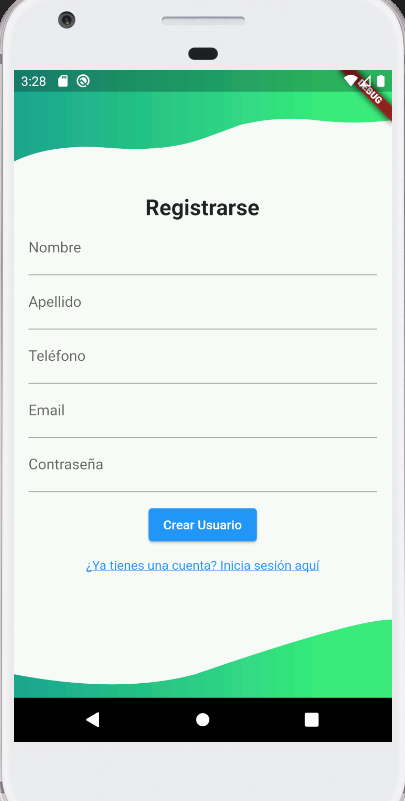
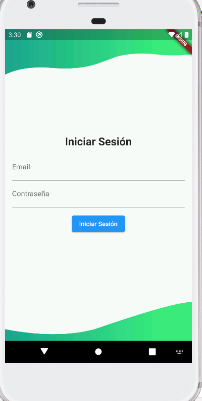
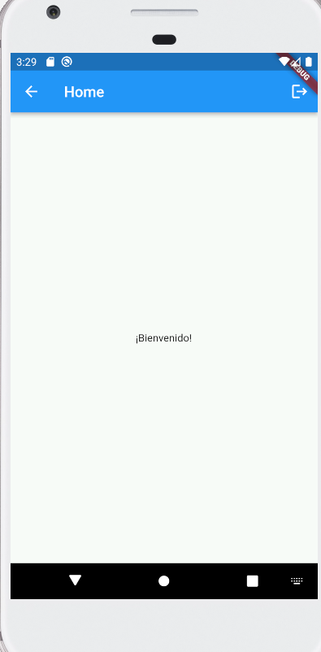
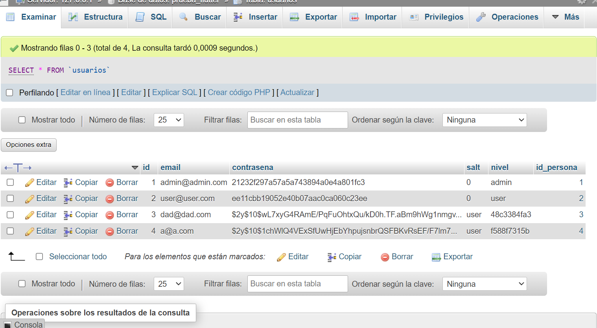

## Instrucciones para Levantar el Proyecto

Este proyecto es una aplicación Flutter para crear usuarios mediante una solicitud HTTP a un API REST alojada en un servidor. A continuación, se proporcionan los pasos y comandos para levantar este proyecto, junto con las dependencias que está utilizando.

### Requisitos Previos
- Asegúrate de tener [Flutter](https://flutter.dev/docs/get-started/install) instalado en tu máquina.
- Asegúrate de tener un editor de código compatible con Flutter, como [Visual Studio Code](https://code.visualstudio.com/) con el complemento Flutter instalado.

### Pasos para Levantar el Proyecto

1. **Clonar el Repositorio**
   ```bash
   git clone https://github.com/tu_usuario/tu_repositorio.git
   cd tu_repositorio
   ```

2. **Instalar Dependencias**
   ```bash
   flutter pub get
   ```

3. **Ejecutar la Aplicación**
   ```bash
   flutter run
   ```
   Esto iniciará la aplicación en el emulador o dispositivo conectado.

4. **Ejecutar el Servidor PHP**
   Asegúrate de que tu servidor PHP esté en ejecución y configurado con los cambios mencionados en `api/config/config.php`.


Asegúrate de tener un servidor PHP en tu máquina y ajusta la URL en el archivo `main.dart` a la dirección del servidor donde se encuentra el script PHP.


```dart
Uri.parse('http://tu_direccion_ip:puerto/ruta_al_script_php')
```

### Dependencias Utilizadas

- [flutter](https://pub.dev/packages/flutter): Framework de desarrollo de aplicaciones móviles.
- [http](https://pub.dev/packages/http): Para realizar solicitudes HTTP.
- [dart:convert](https://api.dart.dev/stable/dart-convert/dart-convert-library.html): Para la manipulación de datos JSON.


### Configuración del API Rest

Se recomienda utilizar uno de los siguientes servidores para ejecutar el servidor PHP y MySQL necesario para este proyecto:

- [WampServer](https://www.wampserver.com/): WampServer es una plataforma para Windows que proporciona un entorno de desarrollo web fácil de instalar y configurar. Incluye Apache, PHP y MySQL preconfigurados.

- [XAMPP](https://www.apachefriends.org/index.html): XAMPP es una solución multiplataforma que incluye Apache, MariaDB (equivalente a MySQL), PHP y Perl. Está disponible para Windows, macOS y Linux.

Estos servidores simplifican la configuración del entorno de desarrollo y facilitan la ejecución del servidor PHP y MySQL en tu máquina.

#### Configuración del Servidor PHP

1. Abre el archivo `api/config/config.php` en tu editor de texto.

2. Modifica el contenido del archivo con la información de tu servidor MySQL:
   ```php
   <?php

   $servername = "tu_servidor_mysql";
   $username = "tu_usuario_mysql";
   $password = "tu_contraseña_mysql";
   $database = "tu_base_de_datos";

   $conn = new mysqli($servername, $username, $password, $database);

   if ($conn->connect_error) {
       die("Conexión fallida: " . $conn->connect_error);
   }

   ?>
   ```
   Asegúrate de reemplazar `tu_servidor_mysql`, `tu_usuario_mysql`, `tu_contraseña_mysql` y `tu_base_de_datos` con la información correcta de tu entorno.

#### Configuración de la Base de Datos

1. Instala un cliente MySQL, como [phpMyAdmin](https://www.phpmyadmin.net/) o [MySQL Workbench](https://www.mysql.com/products/workbench/).

2. Importa el archivo SQL ubicado en `api/config/sql` en tu cliente MySQL. Este archivo contiene la estructura de la base de datos necesaria para el proyecto.


¡Ahora deberías tener tanto la aplicación Flutter como el servidor PHP en funcionamiento! Puedes utilizar el formulario en la aplicación para crear nuevos usuarios, y la información se almacenará en la base de datos configurada.

## Capturas de Pantalla

### Formulario de Creación de Usuario


### Respuesta de Flutter


### Base de Datos 
1. Persona

2. Usuario

